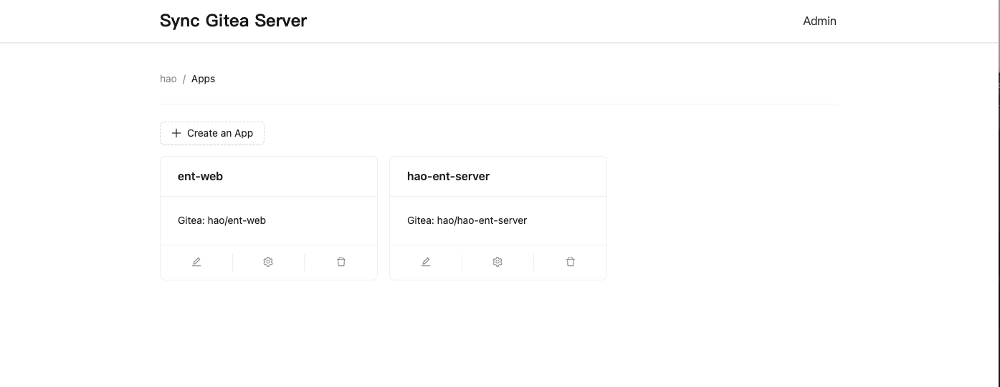
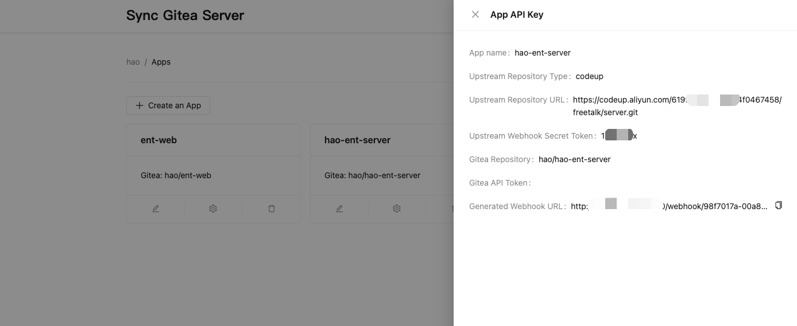

# Sync Gitea Server

This project is a webhook server to help us to synchronize `Gitea` repository changes to our upstream repository.

When the upstream repository is updated, it send a webhook event to this server, and then the server call the `Gitea` API to synchronize the changes.

<table>
  <tr>
    <td>
      
    </td>
    <td>
      
    </td>
  </tr>
</table>

## How to Use

### Environment Variables

- `PORT`: The port of the server, default is `7879`.
- `LOG_LEVEL`: The log level of the server, default is `info`.
- `JWT_SECRET`: The secret key of the JWT token.
- `PUBLIC_URL`: The public URL of the server, used for receiving the webhook event.
- `ENABLE_LOG_IP`: Whether to enable logging IP address in webhook event, default is `false`.
- `GITEA_URL`: The URL of the `Gitea` server. Used for all apps as fallback.
- `GITEA_TOKEN`: The token of the `Gitea` user. Used for all apps as fallback.
- `DISABLE_REGISTRATION`: Whether to disable registration, default is `false`.

## Development

We use `bun` to develop this project, so you need to install it first:

```bash
curl -fsSL https://bun.sh/install | bash
```

### Install dependencies

```bash 
bun install
```

### Run the server

```bash
cd packages/server
bun dev
```

### Run the web

```bash
cd packages/web
bun dev
```

## License

[MIT](./LICENSE)
